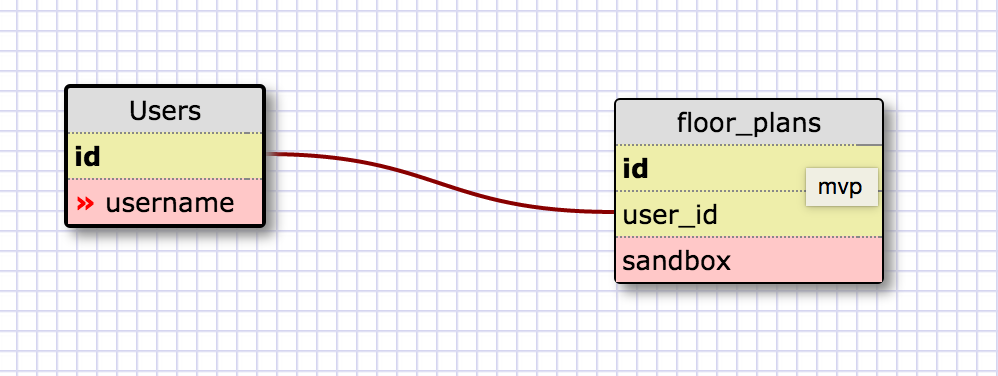
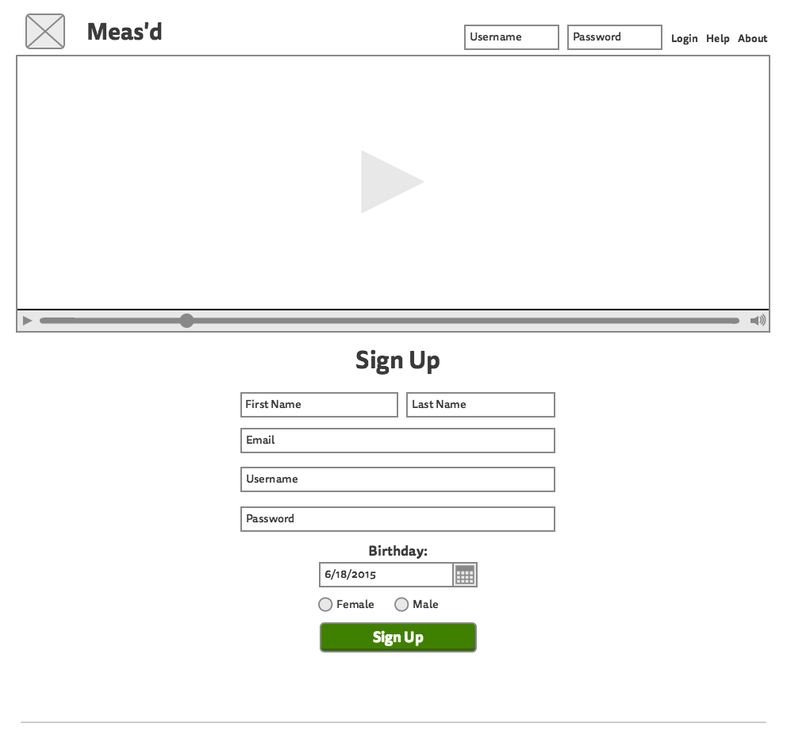
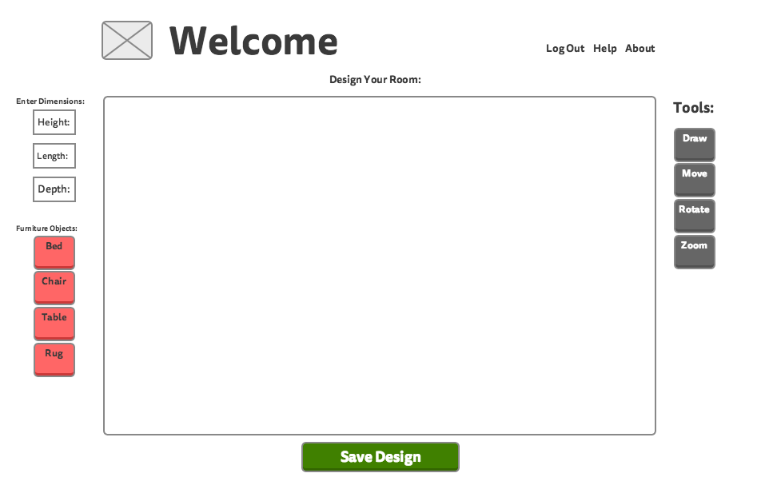

# Meas-d
Final Project MVP Repo

This project's intent is to build an app that aids in the process of moving from start to finish.

Scope of the mvp:
1.
2.
3.
4.
5.

Back-end: Rails Server
  - fucntions as a json-api

Front-end:
 -??

Database Schema (mvp):

Wire Frame (mvp)

